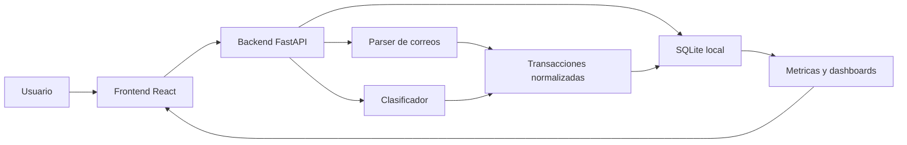

# Arquitectura de FinEx

FinEx se desarrollara por fases. La arquitectura queda preparada para crecer desde un prototipo local hasta una aplicacion de escritorio con integracion Gmail.

## Vision general



## Capas

| Capa | Responsabilidad | Fase inicial |
|---|---|---|
| Frontend | Dashboard real, layout, registro manual, importacion Gmail, categorias, personas, obligaciones, cuentas, inversiones y reglas | Fase 9 implementada |
| Backend | API local, validacion, persistencia, CRUD base, flujos manuales, Gmail, importaciones, cuentas, inversiones, reglas y agregaciones | Fase 9 implementada |
| Base de datos | SQLite local con migraciones Alembic, desgloses, obligaciones, cuentas financieras e inversiones | Fase 8 implementada |
| Parser | Extraer fecha, monto, comercio, contraparte y categoria sugerida desde textos o correos | Fase 5 implementada |
| Gmail | Leer correos con Gmail API, OAuth y permisos minimos | Fase 6 implementada |
| Obligaciones y UX contextual | Pulir Gmail incremental, cuentas por cobrar/pagar, balanceos, ajustes y formularios minimos | Fase 7 implementada |
| Saldos e inversiones | Detectar tarjeta/cuenta desde correos, estimar saldos y separar inversion/desinversion de gasto/ingreso | Fase 8 implementada |
| Clasificador | Sugerir categorias, cuentas y reglas corregibles sobre datos reales ya conectados | Fase 9 implementada |

## Estructura de carpetas

```text
backend/
  app/
    api/        Rutas HTTP
    core/       Configuracion, seguridad y utilidades base
    db/         Conexion, sesiones y migraciones futuras
    models/     Modelos SQLAlchemy
    schemas/    Esquemas Pydantic
    services/   Parser, clasificador, metricas e integraciones
  tests/        Tests especificos del backend

frontend/
  public/       Assets publicos
  src/          Aplicacion React, componentes, features, lib y tests

data/
  demo/         Datos inventados para demos y pruebas
  imports/      Archivos controlados de importacion
  local/        Datos locales ignorados por git

docs/
  architecture.md
  privacy.md
  security-checklist.md

scripts/
  init_db.py
  phase0_check.py
```

## Decisiones de Fase 0

- Package manager: pnpm.
- Python recomendado: 3.11.
- Base de datos local: SQLite.
- Backend: FastAPI.
- Frontend: React + TypeScript + Vite.
- Datos reales: fuera del repositorio.

## Comandos

| Comando | Proposito |
|---|---|
| `pnpm dev` | Levanta el frontend Vite local en `127.0.0.1:5173`. |
| `pnpm backend:dev` | Levanta la API FastAPI local en `127.0.0.1:8000`. |
| `pnpm backend:dev:reload` | Levanta la API con recarga automatica cuando el entorno lo permita. |
| `pnpm build` | Compila el frontend para produccion. |
| `pnpm test` | Ejecuta tests backend y frontend. |
| `pnpm lint` | Ejecuta chequeo local de estructura y TypeScript. |
| `python -m pytest` | Corre las pruebas Python directamente. |
| `pnpm backend:init-db` | Ejecuta migraciones y siembra categorias base. |

## Fase 3 implementada

- `categories` soporta `kind` (`expense`, `income`, `both`) y parent opcional.
- `transactions` soporta `income`, `loan_out`, `receivable_payment`, persona asociada y cuenta por cobrar asociada.
- `transaction_splits` permite repartir una compra en varias categorias.
- `people`, `receivables` y `receivable_payments` cubren alumnos, deudores, saldos pendientes y pagos parciales.
- El frontend consume la API real para crear movimientos, categorias, personas, deudas y pagos.

## Fase 4 implementada

- `GET /api/v1/dashboard/overview` entrega metricas, series diarias, rankings, revision, deudas y suscripciones.
- `GET /api/v1/dashboard/categories`, `/merchants`, `/subscriptions` y `/review` exponen cortes auxiliares.
- El calculo de gasto por categoria usa `transaction_splits` si existen; si no, usa la categoria de cabecera.
- Los ingresos por clases se calculan separados de gastos, y el balance neto usa `ingresos - gastos`.
- Las cuentas por cobrar se muestran como saldo pendiente y no se mezclan con gastos reales.

## Fase 5 implementada

- `POST /api/v1/import/text` recibe texto pegado desde un correo y devuelve una transaccion candidata.
- `POST /api/v1/import/demo` carga `data/demo/sample_emails.json` y crea candidatos revisables.
- `POST /api/v1/import/confirm` convierte un candidato en transaccion, con soporte para desgloses y pagos de cuentas por cobrar.
- `POST /api/v1/import/discard` marca el correo como descartado sin crear movimiento.
- `EmailMessage` guarda asunto, remitente, vista previa, hash del cuerpo y estado de parseo; `ImportRun` registra el lote.
- El parser es deterministico y local: detecta montos CLP, supermercados, delivery, suscripciones, transferencias, pagos de clases, compras con tarjeta y direccion de flujo ingreso/egreso.

## Fase 6 implementada

- `GET /api/v1/gmail/status` informa credenciales, conexion, scopes y ultima sincronizacion.
- `GET /api/v1/gmail/connect` y `/callback` implementan OAuth 2.0 local para Gmail API.
- `POST /api/v1/gmail/sync` trae mensajes recientes, filtra irrelevantes, evita duplicados y crea candidatos revisables.
- `POST /api/v1/gmail/disconnect` elimina el token local.
- `gmail_client.py` encapsula OAuth, llamadas a Gmail API y normalizacion de mensajes; el parser sigue desacoplado.
- `GmailSyncState` guarda `history_id`, `last_sync_at` y `last_poll_at` por label.
- `docs/gmail-setup.md` documenta donde colocar credenciales y como autorizar la cuenta.

## Fase 7 implementada

- `payables` y `payable_payments` modelan cuentas por pagar sin mezclarlas con gasto/ingreso real.
- `POST /api/v1/gmail/sync` reprocesa mensajes guardados con errores de parser y mantiene historial visible.
- La confirmacion de importaciones puede crear o asociar personas, cuentas por cobrar y cuentas por pagar.
- Dashboard y transacciones tratan pagos de obligaciones como movimientos de balance.

## Reglas de UX contextual pendientes de excelencia

- La relacion del movimiento (`amigos`, `trabajo`, `mi`, `novia`, `ninguna`) es transversal a ingresos, gastos, transferencias, inversiones y ajustes.
- La relacion por defecto es `ninguna`.
- Persona no es un campo universal: solo debe aparecer en cuentas por cobrar, cuentas por pagar, balanceo de obligaciones o seguimiento opcional de clases por alumno.
- Una compra, ingreso o transferencia simple no debe pedir persona.
- Un ingreso por clases no debe fragmentarse por defecto.
- Las transferencias deben mostrar primero una accion seleccionable y desplegar campos de obligacion solo si corresponde.
- Los campos extra deben estar en un panel avanzado o menu "Agregar detalle".

## Fase 8 implementada

- `financial_accounts` y `financial_account_snapshots` modelan cuentas, tarjetas y saldos observados.
- `investment_accounts` e `investment_movements` modelan aportes, rescates y valor actual.
- `transactions` referencia cuenta financiera e inversion, con metadata de deteccion desde Gmail.
- `investment` y `disinvestment` son movimientos de balance: cambian saldos, pero no suben gasto ni ingreso mensual.
- El dashboard agrega resumen de cuentas, inversiones y transacciones sin cuenta asignada.

## Fase 8.1 planificada

- CLP sigue siendo moneda base y no admite decimales.
- USD admite dos decimales para tarjetas con cupo en dolares y compras internacionales.
- Las transacciones deben separar monto original, moneda original, equivalente CLP, tasa de cambio, fecha/fuente de tasa y razon de deteccion.
- Las tarjetas deben declarar moneda de cupo, cupo usado y cupo disponible sin mezclar CLP y USD.
- Las tarjetas de credito deben tener ciclo de facturacion, fecha de pago y monto a pagar editable por ciclo.
- La tarjeta actual se modela inicialmente como dos cuentas separadas: `Credito CLP · 7459` con cupo `$1.000.000` y `Credito USD · 7459` con cupo `US$1,000.00`.
- Los pagos de tarjeta reducen deuda y liberan cupo, pero no se cuentan como gasto nuevo.
- Cada tarjeta puede usar un asset visual generico en `frontend/public/assets/cards/`, con color asignado aleatoriamente y ultimos cuatro digitos renderizados por UI.
- El parser Gmail debe detectar `USD`, `US$`, dolares y montos decimales; compras internacionales ambiguas quedan por revisar antes de impactar dashboards CLP.
- La arquitectura debe usar `Decimal` o unidades menores por moneda, nunca `float`.

## Fase 9 implementada

- `classification_rules` soporta categoria, tipo de transaccion, cuenta financiera, cuenta de inversion, prioridad y confianza.
- `classification_feedback` registra correcciones de categoria, tipo, cuenta e inversion desde edicion de transacciones.
- `rule_classifier.py` aplica reglas deterministicas con razones legibles sobre correos, transacciones y texto de prueba.
- `POST /api/v1/rules/test` permite probar una regla contra texto, correo guardado o transaccion.
- `GET /api/v1/rules/suggestions` agrupa correcciones repetidas para crear reglas sugeridas.
- `pnpm backend:init-db` siembra reglas base idempotentes para comercios, bancos, obligaciones e inversiones.
